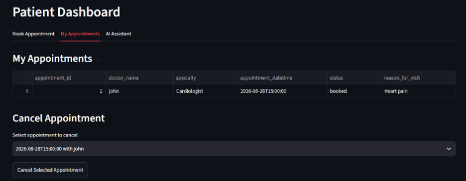
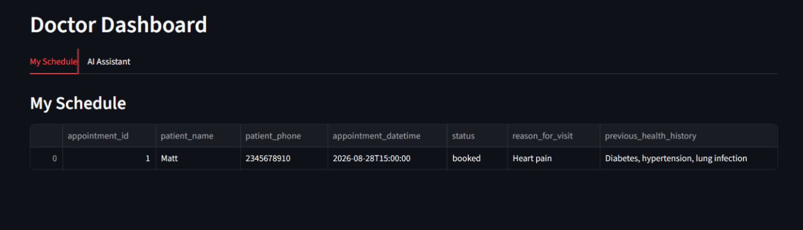
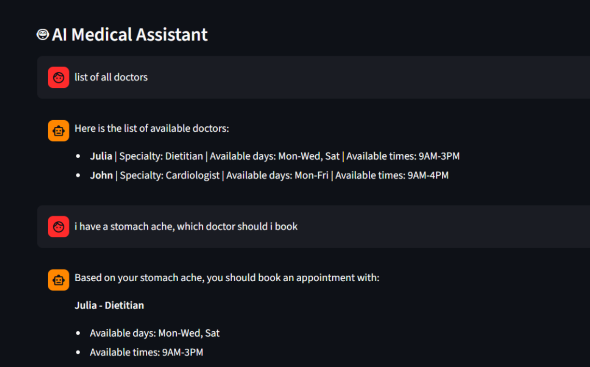
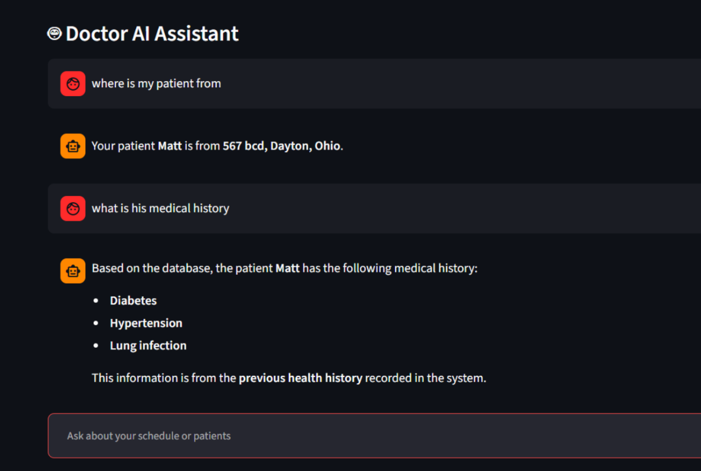
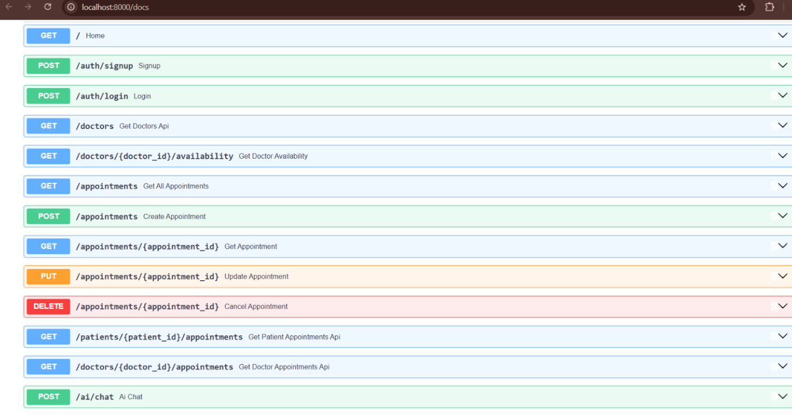

# 🏥 Medical Appointment System

A full-stack medical appointment management platform that enables **patients to book and manage appointments**, **doctors to manage their schedules and appointments**, and both roles to interact with an **AI-powered medical assistant**.

The application is built with a **Streamlit frontend, FastAPI backend, PostgreSQL database, Docker, and an LLM-powered AI assistant**, providing separate workflows for patients and doctors.

---

##  Features

###  Patient Portal

* Secure patient login
* View available doctors
* Book medical appointments
* View upcoming and previous appointments
* Manage appointment information
* Interact with the AI medical assistant

###  Doctor Portal

* Doctor authentication
* View assigned/upcoming appointments
* Manage patient appointments
* Access patient-related appointment information
* Interact with the AI medical assistant

###  AI Medical Assistant

* Natural-language interaction
* Answers healthcare-related questions
* Provides general medical information
* Supports both patient and doctor workflows
* Integrated into the application through the backend API

> **Note:** The AI assistant is intended for informational purposes and does not replace professional medical diagnosis or treatment.

###  REST API

The backend is built with FastAPI and provides API endpoints for:

* Patient management
* Doctor management
* Appointment management
* AI chat functionality
* Authentication-related workflows

Interactive API documentation is available through FastAPI Swagger UI.

---
# 🖥️ Application Screenshots

## 👤 Patient Dashboard

The patient dashboard provides access to appointment booking, appointment history, and the AI medical assistant.



---

## 👨‍⚕️ Doctor Dashboard

The doctor dashboard provides a dedicated interface for managing appointments and accessing the AI assistant.



---

## 🤖 Patient AI Assistant

Patients can interact with the integrated AI assistant through the application.



---

## 🤖 Doctor AI Assistant

The AI assistant is also available within the doctor workflow.



---

## 🔌 FastAPI Documentation

The backend exposes interactive API documentation through FastAPI's Swagger UI.



#  System Architecture

```text
                        ┌─────────────────────────┐
                        │     Streamlit Frontend  │
                        │                         │
                        │  Patient │ Doctor │ AI │
                        └────────────┬────────────┘
                                     │
                                     │ HTTP Requests
                                     ▼
                        ┌─────────────────────────┐
                        │      FastAPI Backend    │
                        │                         │
                        │ Authentication          │
                        │ Patients                │
                        │ Doctors                 │
                        │ Appointments             │
                        │ AI Assistant             │
                        └───────┬─────────┬───────┘
                                │         │
                    ┌───────────┘         └──────────────┐
                    ▼                                    ▼
          ┌───────────────────┐                ┌──────────────────┐
          │   PostgreSQL      │                │   AI / LLM       │
          │    Database       │                │    Assistant      │
          └───────────────────┘                └──────────────────┘
                               
                        ┌─────────────────────────┐
                        │         Docker          │
                        │                         │
                        │ Frontend │ Backend │ DB│
                        └─────────────────────────┘
```

---

#  Technology Stack

| Layer                | Technology                    |
| -------------------- | ----------------------------- |
| Frontend             | Streamlit                     |
| Backend              | FastAPI                       |
| Programming Language | Python                        |
| Database             | PostgreSQL                    |
| API Server           | Uvicorn                       |
| AI                   | Large Language Model / AI API |
| Containerization     | Docker                        |
| Version Control      | Git & GitHub                  |
| API Documentation    | FastAPI / Swagger UI          |

---

#  Project Structure

```text
medical-appointment-system/
│
├── backend/
│   ├── main.py
│   ├── requirements.txt
│   └── ...
│
├── frontend/
│   ├── app.py
│   ├── requirements.txt
│   └── ...
│
├── screenshots/
│   ├── patient-dashboard.png
│   ├── doctor-dashboard.png
│   ├── patient-ai-assistant.png
│   ├── doctor-ai-assistant.png
│   ├── appointment-booking.png
│   └── fastapi-docs.png
│
├── docker-compose.yml
├── .gitignore
└── README.md
```

---

#  Running the Application

## Prerequisites

Make sure you have the following installed:

* Python 3.11+
* Docker Desktop
* Git

---

## 1. Clone the Repository

```bash
git clone https://github.com/juliagrace07/medical-appointment-system.git
cd medical-appointment-system
```

---

## 2. Configure Environment Variables

Create a `.env` file containing the required configuration.

Example:

```env
DATABASE_URL=your_database_connection_string
AI_API_KEY=your_api_key
```

> Never commit API keys, passwords, database credentials, or other secrets to GitHub.

---

## 3. Build the Docker Containers

```bash
docker compose build
```

---

## 4. Start the Application

```bash
docker compose up -d
```

---

## 5. Check Running Containers

```bash
docker ps
```

You should see the application containers running.

---

#  Accessing the Application

Once the containers are running:

### Frontend

```text
http://localhost:8501
```

### FastAPI Backend

```text
http://localhost:8000
```

### FastAPI Swagger Documentation

```text
http://localhost:8000/docs
```

### FastAPI ReDoc

```text
http://localhost:8000/redoc
```

---

#  API Overview

The FastAPI backend provides RESTful endpoints for the application's core functionality.

Example endpoint categories include:

```text
GET     /doctors
GET     /patients/{patient_id}/appointments
POST    /appointments
POST    /ai/chat
```

The complete API can be explored through:

```text
http://localhost:8000/docs
```

---

#  Database

The application uses **PostgreSQL** for persistent storage.

The database manages information such as:

* Patients
* Doctors
* Appointments
* User-related information
* Appointment relationships

The backend communicates with PostgreSQL through the application's API layer.

---

#  Docker Architecture

The application is containerized to provide a consistent development and deployment environment.

```text
┌──────────────────────────────┐
│          Docker              │
│                              │
│  ┌──────────┐                │
│  │ Frontend │ :8501          │
│  └────┬─────┘                │
│       │                      │
│  ┌────▼─────┐                │
│  │ Backend  │ :8000          │
│  └────┬─────┘                │
│       │                      │
│  ┌────▼─────┐                │
│  │PostgreSQL│                │
│  └──────────┘                │
│                              │
└──────────────────────────────┘
```

Docker helps isolate the application services and simplifies local setup.

---

#  Development & Testing

Useful Docker commands:

### View running containers

```bash
docker ps
```

### View backend logs

```bash
docker logs medical_backend
```

### View frontend logs

```bash
docker logs medical_frontend
```

### Stop the application

```bash
docker compose down
```

### Rebuild the application

```bash
docker compose build
```

### Rebuild and restart

```bash
docker compose up -d --build
```

---

#  Security Considerations

The project follows basic application security practices including:

* Environment variables for sensitive configuration
* `.gitignore` to prevent accidental secret commits
* Separation between frontend and backend
* Backend API layer for database access
* Role-specific application workflows

**API keys and database credentials should never be committed to the repository.**

---

#  Key Engineering Concepts Demonstrated

This project demonstrates practical experience with:

* Full-stack application development
* REST API development
* FastAPI
* Streamlit
* PostgreSQL
* Docker containerization
* Client-server architecture
* Database integration
* API documentation
* Authentication and role-based workflows
* AI/LLM integration
* Git and GitHub
* Environment configuration
* Debugging containerized applications

---

#  Future Improvements

Potential future enhancements include:

* [ ] JWT-based authentication
* [ ] Password hashing and improved authentication security
* [ ] Email appointment notifications
* [ ] Calendar integration
* [ ] Doctor availability management
* [ ] Appointment cancellation/rescheduling
* [ ] Improved AI response grounding
* [ ] Medical knowledge retrieval using RAG
* [ ] Automated backend testing
* [ ] CI/CD pipeline
* [ ] Cloud deployment
* [ ] Production monitoring and logging

---

#  What I Learned

Building this project provided hands-on experience developing and debugging a multi-service application.

Key areas included:

* Designing RESTful APIs with FastAPI
* Connecting a Python backend to PostgreSQL
* Building interactive interfaces with Streamlit
* Integrating AI functionality into an existing application
* Containerizing multiple services with Docker
* Managing communication between frontend, backend, and database services
* Debugging API and Docker-related issues
* Documenting APIs using Swagger/OpenAPI

---

#  Author

**Julia Grace Muddada**

M.S. Computer Science
Wright State University
LinkedIn: https://www.linkedin.com/in/julia-grace-muddada-6708271b3/


### Areas of Interest

* Software Engineering
* Backend Development
* Full-Stack Development
* AI/ML Applications
* Cloud & DevOps

---

 If you found this project interesting, feel free to explore the repository and its implementation.
